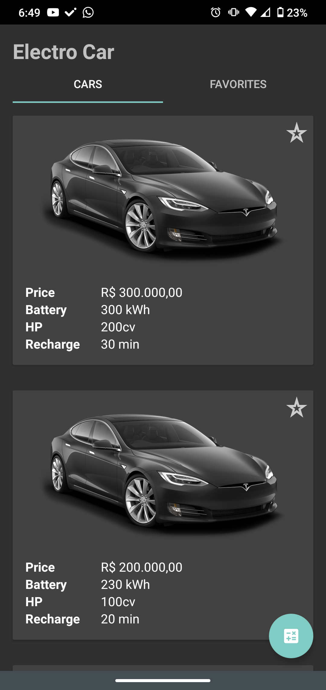
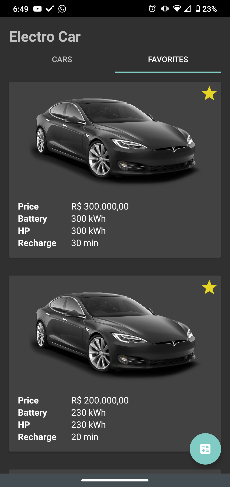
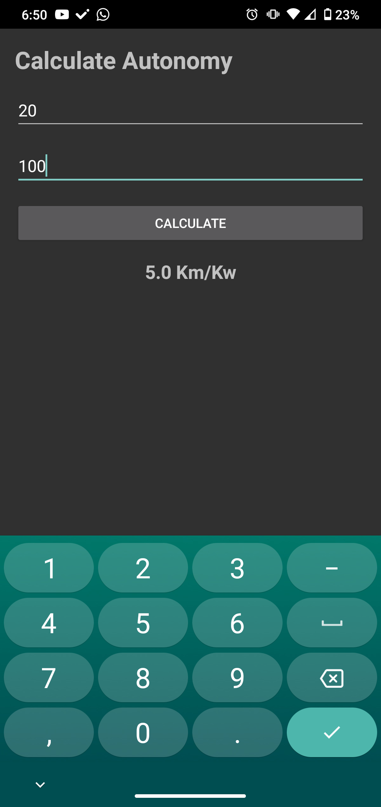

# ElectroCar App

This is for Android Kotlin practicing. API calls, data persistence with SQLite and Activity Lifecycle are the main concepts approached.

## Table of contents

- [Overview](#overview)
  - [The challenge](#the-challenge)
  - [Screenshot](#screenshot)

## Overview

### The challenge

Users should be able to:

- View a list of cars from an API
- Favorite a car and see it in the *Favorites* Fragment
- Calculate autonomy, given the **kW** spent and the **km** traveled

### Screenshot

